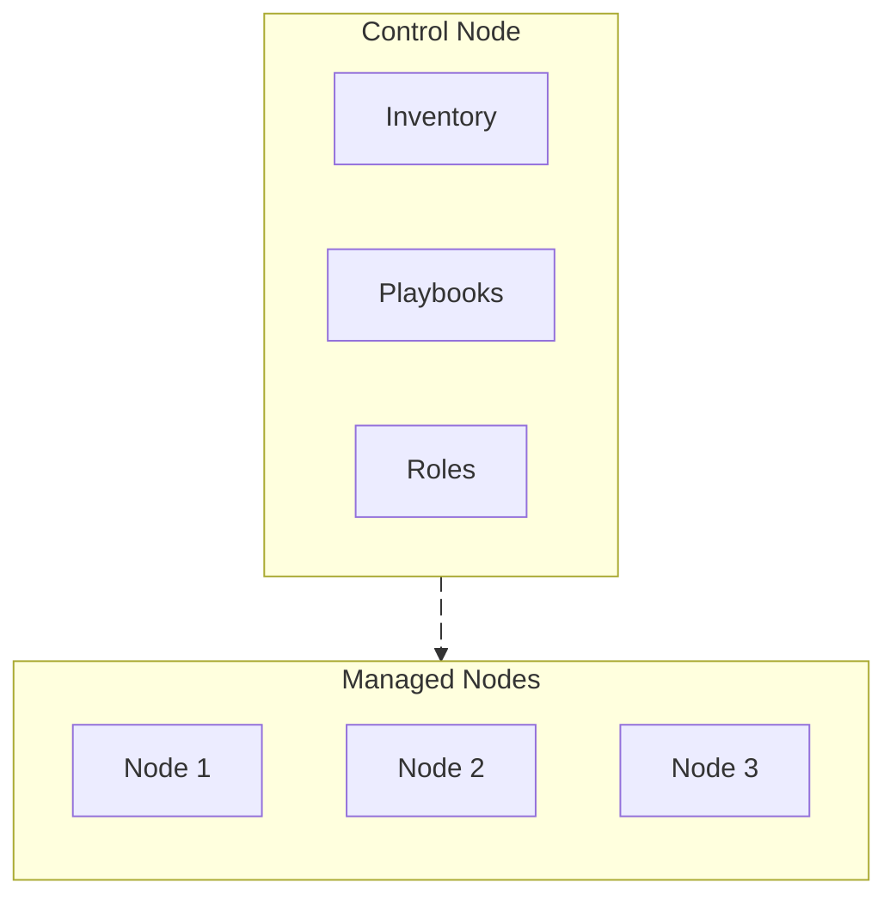

<Callout title="Documentation">
  - [Getting started with Ansible](https://docs.ansible.com/projects/ansible/latest/getting_started/index.html)
  - [Overview architecture](https://docs.ansible.com/projects/ansible/latest/dev_guide/overview_architecture.html)
</Callout>

Take a look at this animation diagram, most of the time you will be working on the **control node**.
- **Control node** is the **master node**, it is the one that **controls the managed nodes**, it is the one that **runs the playbooks**, it is the one that **applies the roles**, it is the one that **manages the inventory**.
  - **Inventory** is the **list of managed nodes**. Basically, you can think of it as a list of servers that you want to manage.
  - **Playbooks** are the **instructions** that are **applied to the managed nodes**.
  - **Roles** are the **collections of playbooks** that are **applied to the managed nodes**.
- **Managed nodes** are the **slaves nodes**, they are the ones that are **controlled by the control node**.